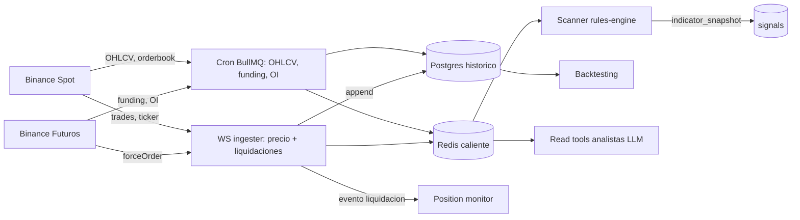
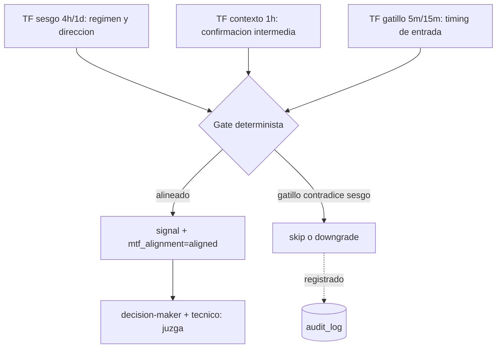
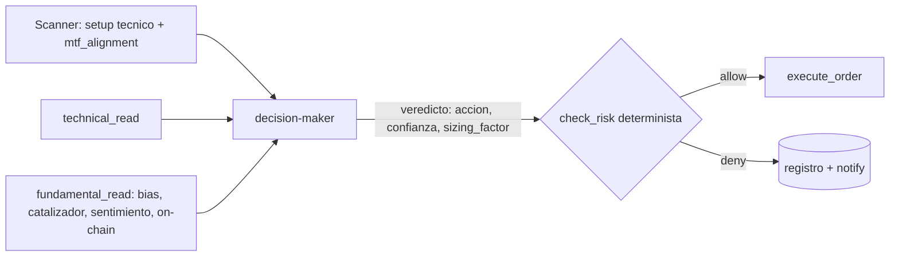
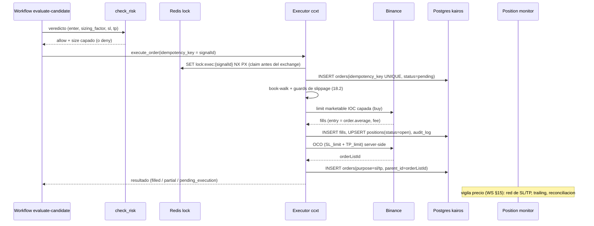
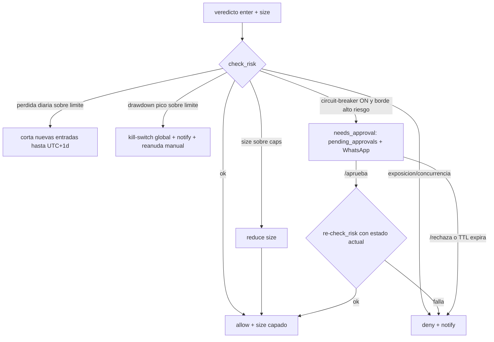
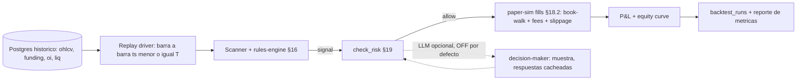

# Kairos — Arquitectura

> Sistema de trading algorítmico autónomo con agentes de IA, construido sobre **Flue 1.0**.
> Documento de diseño. Primera nota del proyecto. Fecha: 2026-06-24.

---

## 1. Resumen ejecutivo

Kairos es un bot de trading de cripto **autónomo**: un *scanner determinista barato* filtra el mercado en cada tick; cuando dispara un setup, **tres agentes LLM** (un decision-maker + dos analistas) razonan y emiten un veredicto explícito; **código determinista e idempotente** verifica ese veredicto contra límites de riesgo duros y ejecuta la orden vía `ccxt`; WhatsApp notifica el razonamiento y permite controlar el bot.

El principio rector: **el LLM tiene juicio, no gatillo.** Los modelos solo *miran* y *proponen*; mover dinero es siempre código auditable.

Corre como **servicio Node siempre-activo en Docker sobre el VPS**, con **PostgreSQL** como estado (de Flue y de dominio) y **Redis** como coordinación.

---

## 2. Decisiones de diseño fijadas

| Decisión | Elección | Razón |
|---|---|---|
| Topología | **Flue Node target en Docker sobre el VPS** | Cloudflare Workers no admite loops continuos/sockets ni acepta Postgres como store de Flue. |
| Cadencia | **Intradía 5m–1h** — REST autoritativo + **WS de enriquecimiento** | Costo LLM controlable; el scanner decide sobre REST (reproducible). El WS añade precio en vivo y stream de liquidaciones sin bloquear el loop: si cae, degrada a REST (ver §15). |
| Rol del LLM | **Juzga candidatos pre-filtrados** por código | Barato, reproducible, auditable. El 95% de los ticks no invocan LLM. |
| Autonomía | **Total**: filtros pasan → ejecuta automático, sin aprobación humana | Decisión explícita del owner. Mitigada por guardrails deterministas (ver §11). |
| Exchange | **Binance** (testnet Spot + datos reales de prod para sim) | Mayor soporte ccxt, testnet gratis, máxima liquidez. |
| Mercado | **Spot, long-only** (opera); **lee derivados como señal** | Opera sin apalancamiento/liquidación/funding (mínimo riesgo al auditar autonomía). Pero **lee** funding/OI/liquidaciones del perp como señal de solo-lectura (ver §15). Operar futures es fase posterior. |
| Estrategias | **Agnóstico**: doctrina como skills, estrategias como config | Kairos es plataforma, no un bot atado a una estrategia. |

---

## 3. Restricciones del framework (Flue) que moldearon el diseño

Hallazgos de la documentación real de Flue (`@flue/runtime` beta.5) que cambiaron el diseño ingenuo:

1. **Cloudflare Workers no puede correr el loop.** Sin `while(true)`, sin websockets persistentes, cron mínimo 1 min, y Flue obliga a Durable Object SQLite (no tu Postgres). → El cerebro vive en el **Node target del VPS**.
2. **Evolution API es incompatible con el canal nativo `@flue/whatsapp`** (que solo habla WhatsApp Cloud API de Meta, con firma `X-Hub-Signature-256`). → Se construye un **canal custom** + tool de salida al REST de Evolution.
3. **Flue no persiste datos de dominio.** Su store guarda solo sesiones/runs/eventos. Posiciones, señales, P&L y config → **esquema propio** en Postgres.
4. **No hay RPC agente-a-agente.** La orquestación se hace con **subagentes** (delegación in-process vía `session.task`) y **workflows** (dirigidos por código), no una malla de procesos.
5. **La idempotencia es responsabilidad de la app.** Los canales no deduplican; Flue solo reintenta cuando la seguridad de replay es *demostrable*, y termina como fallido lo incierto. → Toda ejecución lleva clave de idempotencia.
6. **Node no auto-termina workflow runs interrumpidos** (quedan `active`). → Se usa **BullMQ** como espina durable de la cola/scheduler (retries, stalled jobs), con ejecución idempotente.

---

## 4. Arquitectura de componentes (3 capas)

### Capa 1 — Determinista (SIN LLM)

| Componente | Forma en Flue | Responsabilidad |
|---|---|---|
| **Ingester de market-data** | Proceso long-lived (WS) + jobs BullMQ (REST) | Suscribe precio/liquidaciones por WS y poll de OHLCV/funding/OI por REST; escribe Redis caliente + Postgres histórico; publica eventos. WS es enriquecimiento best-effort; **REST es la fuente autoritativa** (§15). |
| **Scanner / motor de señales** | Job BullMQ + tools puras | Cada N min: `fetch_ohlcv` → calcula indicadores → aplica reglas de la estrategia. Si dispara, escribe `signals` y encola evaluación. |
| **Risk gate** | Función `check_risk` | Límites duros NO negociables: tamaño máx., exposición, pérdida diaria, drawdown, kill-switch, circuit-breaker opcional. Devuelve `allow`/`deny`/`needs_approval`. |
| **Executor** | Función `execute_order` (ccxt) | Coloca la orden con clave de idempotencia, modo `sim`/`testnet`/`live`. Solo tras pasar el risk gate. |
| **Position monitor** | Job BullMQ | Vigila SL/TP, señales de salida, reconciliación de llenados. |
| **Reconciler** | Job de arranque | Compara `positions` (DB) vs exchange real antes de arrancar el scanner. |

### Capa 2 — Razonamiento (LLM)

| Agente | Forma en Flue | Responsabilidad | Modelo |
|---|---|---|---|
| **Decision-maker** | Workflow `evaluate-candidate` (su agente con `subagents`) | Carga el skill de doctrina, delega a los analistas, sintetiza, emite **veredicto estructurado** (Valibot). No ejecuta: propone. | Sonnet 4.6 → Opus en escalación |
| **Analista técnico** | Subagente (profile en `subagents:[]`) | Interpreta los indicadores ya calculados. Solo lectura. | Haiku 4.5 |
| **Analista fundamental** | Subagente | Trae y pesa noticias/sentimiento/on-chain. Solo lectura. | Haiku 4.5 |
| **Control** | Agente continuo (`agents/control.ts`) _(SP11: implementado como **workflow** `workflows/control-maker.ts`, invocado con `invoke()` — ver nota en §11 Flujo C)_ | Interpreta comandos de WhatsApp (`/estado`, `/pausa`, `/cierra`). | Haiku 4.5 |

### Capa 3 — Notificación (sin agente LLM)

El mensaje de WhatsApp se **renderiza por template** desde el registro de decisión (determinista, sin alucinación). Solo el *inbound* de control reabre una sesión LLM.

### Comunicación (no hay RPC agente-a-agente)

```
Scheduler (BullMQ) ──tick──> Scanner (determinista)
                                 │ candidato → INSERT signals + encola job
                                 ▼
                    Workflow evaluate-candidate
                       ├─ session.skill(decision-protocol)   ← razonamiento
                       │     ├─ task(technical-analyst)        ← subagente aislado
                       │     └─ task(fundamental-analyst)       ← subagente aislado
                       │  → veredicto estructurado (Valibot)
                       ├─ check_risk(veredicto)                ← determinista
                       ├─ allow → execute_order(idempotencyKey)← determinista
                       └─ notify (template)                    ← WhatsApp out

WhatsApp in (Evolution) → canal custom → dispatch(control) → comandos seguros
```

---

## 5. Flujos

### Flujo A — Entrada autónoma

1. **Scanner** (cada 5–15 min/estrategia·símbolo): `fetch_ohlcv` → indicadores → reglas. Sin setup → fin (gratis). Con setup → claim idempotente (lock Redis) → `INSERT signals` → encola `evaluate-candidate`.
2. **Decision-maker**: carga skill de la estrategia → `task(technical-analyst)` + `task(fundamental-analyst)` → síntesis → veredicto `{accion, lado, confianza, sizing_factor, sl, tp, razonamiento}`.
3. **Risk gate** (`check_risk`): el filtro final. `deny` → registra y notifica. `allow` → continúa. `needs_approval` → solo si el circuit-breaker está ON (default OFF). (Umbrales, escalado de drawdown y HITL en §19.)
4. **Executor** (`execute_order`): `idempotency_key = signalId` → coloca orden + SL/TP → `UPSERT positions`, `INSERT orders/fills`, `audit_log`. (Flujo exacto, tipos de orden y guard de slippage en §18.)
5. **Notify**: template WhatsApp con entrada + razonamiento.

### Puntos de decisión

| # | Dónde | Quién | Tipo |
|---|---|---|---|
| 1 | ¿Hay setup? | Scanner | Determinista |
| 2 | ¿Entrar o ignorar? | Decision-maker | **LLM (juicio)** |
| 3 | ¿Pasa límites de riesgo? | Risk gate | Determinista (no negociable) |
| 4 | ¿Circuit-breaker? (opcional) | Risk gate + humano | Híbrido, default OFF |
| 5 | ¿Orden llenó/falló? | Executor | Determinista + reintento idempotente |

### Flujo B — Gestión de salida

El **position monitor** corre en el mismo scheduler por cada posición abierta:
- **SL/TP duro tocado** → cierre **inmediato y determinista** (nunca esperas al LLM para cortar pérdidas), reconcilia, calcula P&L, notifica.
- **Señal de salida de la estrategia (reglas)** → encola decisión → el LLM decide cerrar / mover SL (trailing) / mantener.
- **Timeout de tesis** (p. ej. 24h sin moverse) → re-evaluar.

### Flujo C — Canal de control (WhatsApp inbound)

```
Humano → Evolution API → canal custom Flue (valida firma) → dispatch(control)
   /estado     → resume posiciones, P&L, exposición (template)
   /pausa      → kill-switch ON (scanner deja de disparar)
   /reanuda    → kill-switch OFF
   /cierra BTC → close_position (idempotente)
   /modo X     → conmuta sim/testnet/live
   (texto)     → LLM interpreta intención → comando seguro
```

> **(SP11 — desviación de diseño)** El control se implementa como **workflow** `workflows/control-maker.ts`
> invocado con `invoke()` desde `processControlMessage` (no un agente continuo `dispatch`): cada
> comando de WhatsApp es stateless, y Flue recomienda un workflow finito cuando el trabajo no
> continúa entre mensajes. El parsing de comandos slash (`/estado`, `/pausa`, `/reanuda`) es
> **determinista y sin LLM**; el LLM (Haiku low) solo clasifica texto libre en una de las intenciones
> del picklist cerrado. Guardia H2: mensajes `fromMe:true` se descartan antes de procesar (evita el
> lazo de realimentación con las respuestas salientes del propio bot). M2: ack-then-process — el
> webhook responde 200 inmediatamente y procesa en background best-effort.

### Manejo de errores y casos límite

- **Idempotencia**: `UNIQUE(idempotency_key)` en `orders` + claim en Redis antes de actuar. Reintento de BullMQ/Flue nunca duplica.
- **Llenado parcial**: `orders.status = partial` → el monitor reconcilia hasta `filled`/`canceled`; el sizing real sale de los `fills`.
- **Exchange caído / rate-limit**: la tool ccxt reintenta con backoff; si falla, la decisión queda `pending_execution` y se notifica — **nunca** se asume ejecutada.
- **Crash a mitad de decisión**: BullMQ recupera el job (stalled); idempotencia hace seguro reintentar. Las Actions/órdenes completadas no se re-ejecutan.
- **Reconciliación al arranque**: `positions` (DB) vs exchange real → corrige desviaciones → registra en `audit_log` → recién entonces arranca el scanner.

---

## 6. Skills (Markdown)

Los skills **guían el razonamiento; no añaden capacidad ejecutable**. Dos tipos:

### Skills de doctrina (genéricos) — necesarios

| Skill | Para | Encapsula |
|---|---|---|
| `decision-protocol` | Decision-maker | Cómo sintetizar evidencia + **contrato de salida** del veredicto (Valibot) |
| `technical-read` | Subagente técnico | Cómo interpretar indicadores (confluencia, divergencia, régimen) + alineación MTF (§16) |
| `fundamental-read` | Subagente fundamental | Separar catalizador de ruido, decaimiento temporal de noticias (síntesis ponderada en §17) |
| `risk-policy` | Decision-maker | Doctrina cualitativa de cautela/sizing (los límites duros van en código) |

### Skills de estrategia (específicos) — opcionales

Una estrategia es **config declarativa en Postgres** (trigger + skip conditions + sizing), consumida por el `decision-protocol` genérico. El skill por-estrategia es un *escape hatch* solo para matices de juicio difíciles de parametrizar.

```
src/skills/
├─ decision-protocol/SKILL.md   ← necesario
├─ technical-read/SKILL.md      ← necesario
├─ fundamental-read/SKILL.md    ← necesario
├─ risk-policy/SKILL.md         ← necesario
└─ strategies/                  ← slot opcional, vacío al inicio
```

### Frontmatter (validado por Flue contra la spec de Agent Skills)

`name` (required, lowercase-hyphen, = nombre del directorio, ≤64), `description` (required, ≤1024). Opcionales: `license`, `compatibility`, `metadata` (map string→string), `allowed-tools` (aceptado, no forzado).

### Salida estructurada

El veredicto no es prosa libre: se invoca con `result` (Valibot) para forzar JSON validado.

```ts
const verdict = await session.skill('decision-protocol', {
  args: { signal, technical, fundamental, strategyConfig },
  result: v.object({
    accion: v.picklist(['enter', 'skip']),
    lado: v.picklist(['long']),        // spot long-only; 'short' se añade con futures
    confianza: v.picklist(['alta', 'media', 'baja']),
    sizing_factor: v.pipe(v.number(), v.minValue(0), v.maxValue(1)),
    sl: v.number(), tp: v.number(),
    razonamiento: v.string(),
  }),
});
```

---

## 7. Tools (TypeScript)

> **Línea roja de seguridad:** los agentes de razonamiento solo tienen tools de **lectura**. La mutación (ejecutar/cerrar/cancelar) **NO está en el toolset de ningún modelo** — la ejecutan funciones deterministas tras el veredicto. El bucle de tool-calling del LLM nunca dispara una orden.

### Nivel lectura (`defineTool`, van en `tools:[]`)

| Tool | input → output | Lo usa | Reusa |
|---|---|---|---|
| `fetch_ohlcv` | `{symbol, timeframe, limit}` → `{candles[]}` | Scanner, técnico | ccxt |
| `fetch_ticker` | `{symbol}` → `{last, bid, ask}` | Scanner, técnico | ccxt |
| `fetch_order_book` | `{symbol, depth}` → `{bids, asks}` | Técnico | ccxt |
| `calculate_indicators` (RSI, EMA, MACD, ADX, StochRSI, ATR, Bollinger, VWAP, OBV/MFI) | `{candles, params}` → `{features}` | Scanner; técnico | `technicalindicators` npm |
| `find_support_resistance` | `{candles}` → `{levels[]}` | Scanner; técnico | propio |
| `get_technical_snapshot` | `{symbol}` → `{byTimeframe, mtf_alignment, levels}` | Técnico, decision-maker | DB/Redis (computado por el scanner, §16) |
| `fetch_news` | `{symbol, since}` → `{items[]}` | Fundamental | API/MCP |
| `get_sentiment` | `{symbol}` → `{score, sources[]}` | Fundamental | API/MCP |
| `fetch_onchain_metrics` | `{asset}` → `{flows, activeAddr,...}` | Fundamental | API/MCP |
| `get_derivatives_signals` | `{symbol}` → `{funding, fundingZ, oi, oiChangePct, liqImbalance}` | Fundamental, scanner, decision-maker | DB/Redis (poblado por el ingester, §15) |
| `get_open_positions` | `{}` → `{positions[]}` | Decision-maker, control | DB |
| `get_account_balance` | `{}` → `{balances[]}` | Decision-maker | ccxt (cred. en closure) |
| `get_exposure` | `{}` → `{netExposure, byAsset, corr}` | Decision-maker | DB |
| `get_order_status` | `{orderId}` → `{status, filled}` | Monitor, control | ccxt |

### Nivel control/mutación (funciones deterministas, NUNCA en un modelo)

`check_risk` (evalúa, no muta), `execute_order`, `set_stop_take`, `close_position`, `cancel_order`. Todas con I/O validado; las que mutan llevan idempotencia. (Tipos de orden, bracket OCO y secuencia en §18.)

### IO

`send_whatsapp` (outbound al REST de Evolution; usado por el notificador y la respuesta del control).

### Seguridad: credenciales en closures

Las API keys del exchange y el account-id van en **closure** (factory que recibe la identidad del agente), nunca en el `input` elegido por el modelo. El modelo elige `symbol`/`size`; jamás la cuenta ni la key.

**Dos clientes ccxt separados** (minimiza dónde vive la credencial):
- **Público, sin API key** — el ingester de market-data (§15) y todas las read tools de datos públicos (`fetch_ohlcv`, `fetch_ticker`, `fetch_order_book`, `calculate_indicators`, `get_technical_snapshot`, `get_derivatives_signals`). Alto volumen (WS + polls), sin secretos que exponer.
- **Autenticado, credencial en closure** — solo `execute_order`, `set_stop_take`, `close_position`, `cancel_order`, `get_account_balance`, `get_order_status`. La superficie con permiso de orden se reduce al mínimo.

---

## 8. Gestión de estado

| Capa | Almacén | Gobierna | Guarda |
|---|---|---|---|
| Runtime | Postgres (`flue_*`) | Flue (`@flue/postgres`) | Sesiones, runs, eventos |
| Dominio | Postgres (esquema `kairos`) | **Tú** | Posiciones, señales, decisiones, órdenes, P&L, config |
| Coordinación | Redis | Tú | Caché, locks, rate-limit, cola (BullMQ), kill-switch caliente |

Una sola base Postgres, dos namespaces. Wiring de Flue:

```ts
// src/db.ts
import { postgres } from '@flue/postgres';
export default postgres(process.env.DATABASE_URL!);
```

### Esquema de dominio (append-first)

| Tabla | Columnas clave | Rol |
|---|---|---|
| `strategies` | `id, enabled, timeframe, symbols[], trigger_config jsonb, risk_params jsonb, skill_name?, version` | Config declarativa (hot-reload); `trigger_config` = árbol de reglas MTF + skip (§16) |
| `signals` | `id(ulid), strategy_id, symbol, fired_at, indicator_snapshot jsonb, status` | Historial de señales |
| `decisions` | `id, signal_id, verdict jsonb, reasoning text, technical_read jsonb, fundamental_read jsonb, model_used, tokens` | Razonamiento explícito (append-only) |
| `risk_evaluations` | `id, decision_id, result, reason, adjusted_size, limits_snapshot jsonb` | Auditoría del gate |
| `orders` | `id, idempotency_key UNIQUE, decision_id, side, size, type, tif, purpose(entry/sl/tp), parent_id, status, exchange_order_id, mode` | Guardia DB contra duplicados; `purpose`/`parent_id` ligan los legs del OCO (§18) |
| `fills` | `id, order_id, price, qty, fee, ts` | Reconciliación de llenados |
| `positions` | `id, symbol, side, entry, size, sl, tp, status, realized_pnl, strategy_id, mode` | Posiciones abiertas (source of truth); `mode` aísla sim/testnet/live para el reconciler |
| `account_snapshots` | `id, ts, equity, peak_equity, drawdown, daily_pnl` | Límites de pérdida diaria/drawdown (§19); `id` (ULID) PK del snapshot append-only |
| `pending_approvals` | `id, decision_id, reason, payload jsonb, status(pending/approved/rejected/expired), expires_at, resolved_by, resolved_at` | Circuit-breaker async, resuelto por WhatsApp (§19); NO es pausa de workflow |
| `audit_log` | `ts, event_type, actor, payload jsonb` | Rastro completo |
| `ohlcv_candles` | `symbol, timeframe, open_time, o,h,l,c,v, PK(symbol,timeframe,open_time)` | Histórico de velas **cerradas** (alimenta backtest, §20) |
| `funding_rates` | `symbol, ts, rate, PK(symbol,ts)` | Funding histórico del perp (señal, §15) |
| `open_interest` | `symbol, ts, oi, oi_value, PK(symbol,ts)` | OI histórico del perp (señal, §15) |
| `liquidations` | `id, symbol, ts, side, price, qty, notional` | Liquidaciones del perp (señal, §15) |
| `backtest_runs` | `id, strategy_id, strategy_version, window, mode(det/llm), sim_params jsonb, metrics jsonb, created_at` | Resultado reproducible de un backtest (§20) |

### Redis (coordinación, NO store de Flue)

| Uso | Patrón | Nota |
|---|---|---|
| Caché OHLCV | `ohlcv:{sym}:{tf}` TTL ≈ 1 vela | Evita martillar el exchange |
| Precio en vivo (WS) | `px:{sym}` (último trade) + `liq:{sym}:roll` (ventana de liquidaciones) | Lo escribe el ingester WS; consumo sub-cadencia para monitor/sizing (§15) |
| Lock por candidato | `SET lock:decision:{sym}:{strat} NX PX` | Un solo evaluador por setup |
| Rate-limit | token bucket por exchange | Respeta límites API |
| Cola/scheduler | **BullMQ** | Cadencia + jobs; sobrevive reinicios + retries |
| Kill-switch caliente | `kairos:killswitch` | Copia rápida; la durable vive en Postgres |

> **Ops:** caché y locks quieren TTL (eviction OK) → el Redis actual sirve. **BullMQ necesita `noeviction`** → DB/instancia Redis dedicada. Esto también tapa el hueco de Node con los workflow runs colgados.

---

## 9. Modelos por agente

| Componente | Modelo | `thinkingLevel` | Por qué |
|---|---|---|---|
| Decision-maker | `anthropic/claude-sonnet-4-6` → **Opus** en escalación | `high` | Juicio que mueve dinero; volumen bajo |
| Analista técnico | `anthropic/claude-haiku-4-5` | `medium` | Interpreta números ya calculados |
| Analista fundamental | `anthropic/claude-haiku-4-5` | `medium` | Recuperación + síntesis |
| Control | `anthropic/claude-haiku-4-5` | `low` | Parseo de intención simple, latencia importa |
| Notificador / Scanner / Risk / Executor | — (sin LLM) | — | Determinista |

> Formato Flue `<provider>/<modelId>`, con override por operación. El id exacto de Opus depende del catálogo de Pi al hacer build — verificar en `flue dev`.

### Escalación a Opus (regla determinista, no la decide el modelo)

`shouldEscalate` = verdadero cuando: notional > X% del equity, **o** primera operación live de una estrategia nueva, **o** (tras pasada Sonnet) confianza = baja, **o** los analistas se contradicen.

**(SP10)** En sombra solo aplican confianza-baja y contradicción-de-analistas (no hay equity disponible en `ShadowEvalArgs`); notional y primera-op-live se cablean con equity en testnet/live.

### Resiliencia

Flue **no trae failover de modelo**. La orquestación envuelve la llamada y reintenta ante error de proveedor (**(SP10)** con el **mismo** modelo — un secundario vía `registerProvider` es upgrade futuro). La resiliencia NO escala de modelo: la escalación a Opus es una **segunda pasada deliberada** gobernada por `shouldEscalate` (§294), no un fallback de resiliencia.

### Forma del costo por candidato

```
Tick sin setup    → $0            (scanner, ~95% de los casos)
Candidato normal  → 1×Sonnet + ~2×Haiku
Candidato gordo   → 1×Opus   + ~2×Haiku
```
Palancas: fundamental condicional (skip si no hay noticias en la ventana), analistas secuenciales (Haiku rápido, no requiere paralelizar).

---

## 10. Exchange y ejecución (Binance, Spot long-only)

### Tres modos de ejecución (madurez progresiva)

| Modo | Qué hace | Para qué | Costo |
|---|---|---|---|
| **sim** (default) | Llena órdenes contra datos reales de prod, sin tocar el exchange | Medir el *edge* real (replay histórico = backtesting, §20) | Gratis |
| **testnet** | API sandbox de Binance (`ccxt.setSandboxMode(true)`, claves de testnet) | Validar el plumbing real de órdenes | Gratis |
| **live** | Dinero real, poco capital | Producción | Fees ~0.1% taker |

Madurez: **sim** (¿gana?) → **testnet** (¿el código funciona?) → **live**.

### Cómo se calcula el precio del trade

**Live/testnet — lo devuelve el exchange:**
```
order = ccxt.createOrder(symbol, 'limit', 'buy', size, capPrice, { timeInForce: 'IOC' })  // marketable, capada (§18)
entry = order.average    // VWAP real de llenados — se registra tal cual
fee   = order.fee
```

**Sim — se modela (honesto, o el backtest miente):**
```
book  = fetch_order_book(symbol)
fill  = best_ask * (1 + slippage_bps/10000)   // compra contra el ask
//  mejor: caminar niveles del book hasta cubrir size → VWAP
entry = fill
fee   = size * fill * taker_rate              // restar fees SIEMPRE
```
Regla: en sim asumir precio algo peor que el mid (spread + slippage + fees).

### Sizing (sale del riesgo, no al revés)

```
risk_amount   = equity * risk_per_trade_pct        // p.ej. 1% (techo duro en §19)
stop_distance = |entry - sl|                        // SL del ATR o estructura (§19)
size          = (risk_amount / stop_distance) * verdict.sizing_factor
notional      = size * entry                        // capado por check_risk (§19)
//  spot: notional ≤ balance quote disponible (no se compra lo que no se tiene)
```

### P&L

```
no realizado = (precio_actual - entry) * size - fees
realizado    = (exit - entry) * size - fee_entrada - fee_salida
```
Todo en quote (USDT). Persistido en `positions.realized_pnl` y `account_snapshots`.

> En **Spot** no hay mark price, funding ni liquidación *propios*: el P&L y el sizing spot no los usan. Kairos sí **lee** funding/OI/liquidaciones del **perp** como señal de solo-lectura (§15), pero no opera futures. Operar futures (mark price, funding, liquidación propios) es fase posterior.

---

## 11. Riesgos y mitigaciones

La autonomía total es una decisión explícita del owner. Mitigaciones de ingeniería que la hacen *segura por construcción*:

| Riesgo | Mitigación |
|---|---|
| Veredicto LLM alucinado mueve dinero | El LLM no tiene tools de mutación; ejecuta código determinista tras el risk gate |
| Un solo trade vacía la cuenta | `check_risk`: tamaño máx., exposición, pérdida diaria, drawdown — límites duros en código (umbrales y escalado en §19) |
| Órdenes duplicadas tras crash | `idempotency_key` + `UNIQUE` en `orders` + claim en Redis |
| Pérdida sin cortar por caída del LLM | SL/TP duro es determinista e inmediato, no depende de una llamada LLM |
| Estado obsoleto tras downtime | Reconciliación exchange↔DB al arranque |
| Workflow colgado en Node | BullMQ posee liveness/retry; idempotencia hace seguro reintentar |
| Caída del proveedor LLM | Failover en orquestación a modelo alterno |
| Circuit-breaker | `needs_approval` opcional (default OFF) para casos extremos (notional > umbral, anomalía). Cuando está ON, la ejecución se difiere a un registro `pending_approval` resuelto por el canal de control (WhatsApp) — **no** por una pausa de workflow, que Flue no soporta a medio paso (triggers, TTL y patrón en §19) |

---

## 12. Estructura de proyecto (Flue Node)

```
kairos/
├─ flue.config.ts
├─ Dockerfile                  # node:22-slim, servicio long-running
├─ .env
├─ src/
│  ├─ app.ts                   # rutas/middleware, health, control webhook
│  ├─ db.ts                    # postgres() → store de Flue
│  ├─ agents/
│  │  └─ control.ts            # sesión de comandos WhatsApp (descubierto) [SP11: reemplazado por workflows/control-maker.ts]
│  ├─ workflows/
│  │  ├─ evaluate-candidate.ts # pipeline decisión+riesgo+ejecución (descubierto)
│  │  └─ control-maker.ts      # (SP11) workflow de control WhatsApp — clasifica texto libre con LLM; slash-commands son deterministas
│  ├─ channels/
│  │  └─ evolution.ts          # canal custom WhatsApp inbound (descubierto)
│  ├─ subagents/               # profiles (importados, no descubiertos)
│  │  ├─ technical-analyst.ts
│  │  └─ fundamental-analyst.ts
│  ├─ tools/                   # importadas: market-data, indicators, fundamental, account
│  ├─ lib/                     # núcleo determinista (NO model-callable)
│  │  ├─ ccxt-client.ts  scanner.ts  rules-engine.ts
│  │  ├─ risk.ts  execution.ts  paper-sim.ts  reconcile.ts  scheduler.ts
│  ├─ db/                      # repositorios de dominio + schema.sql (esquema kairos)
│  ├─ skills/                  # doctrina (importados con `with { type: 'skill' }`)
│  └─ notify/whatsapp.ts       # send_whatsapp + templates
└─ dist/
```

---

## 13. Fases

1. **Fase 0 — Andamiaje**: proyecto Flue, db.ts, esquema de dominio, ccxt-client, canal Evolution + send_whatsapp.
2. **Fase 1 — Loop determinista (sin LLM)**: scanner + reglas + risk gate + executor en modo **sim**, monitor de salida, reconciler. Valida el pipeline end-to-end sin gastar en LLM. El backtester (replay histórico, §20) valida aquí el *edge mecánico* de las estrategias.
3. **Fase 2 — Razonamiento**: decision-maker + analistas + skills de doctrina. Sigue en **sim** para medir edge.
4. **Fase 3 — Testnet**: conmuta a Binance testnet, valida el plumbing real de órdenes.
5. **Fase 4 — Live** (poco capital): activa guardrails al máximo, observa.
6. **Fase 5 — Dashboard** (fuera de alcance de este diseño): tiempo real, gráficos, posiciones, config visual de estrategias.

---

## 14. Fuera de alcance (por ahora)

- Dashboard en tiempo real (fase 2 del producto).
- Futures / perp / apalancamiento / shorts.
- Múltiples exchanges simultáneos.
- Aprobación humana por trade (se decidió autonomía total; queda el circuit-breaker opcional).

---

> **Parte II — Profundización técnica.** §1–§14 fijan el diseño y las decisiones; §15+ profundizan
> cada subsistema del lado trading. Donde una decisión actualiza una sección previa, se anota.

## 15. Datos de mercado (ingesta, almacenamiento, señales derivadas)

> **Decisión.** Kairos **opera** solo Spot long-only, pero **lee** datos del perp (funding, OI,
> liquidaciones) como señal de solo-lectura. La ingesta es **REST autoritativo + WS de
> enriquecimiento**: el WS aporta baja latencia pero nunca es la fuente de verdad — si cae, el
> loop sigue con REST. (Actualiza §2: filas "Cadencia" y "Mercado".)

### 15.1 Principio: REST autoritativo, WS best-effort

El loop determinista (scanner, risk gate, executor, reconciler) **decide siempre sobre datos
REST**, que son consistentes y reproducibles. El WS es una **capa de enriquecimiento** que
añade (a) precio en vivo sub-cadencia para el monitor de posiciones y el sizing, y (b) el stream
de liquidaciones para detectar cascadas. Una caída del WS **degrada** (perdemos rapidez de
detección y precio intra-vela) pero **no bloquea** ninguna decisión que mueva dinero.

### 15.2 Catálogo de datos

| Dato | Mercado | Cadencia | Vía | Consumidor |
|---|---|---|---|---|
| OHLCV (velas) | Spot | Al cierre de cada vela del TF (5m/15m/1h) | REST (cron BullMQ) | Scanner, técnico, backtest |
| Precio / ticker | Spot | Continuo (sub-seg) + fallback REST por tick | WS (`watchTrades`/`watchTicker`) | Monitor de posición, sizing, slippage |
| Orderbook (profundidad) | Spot | On-demand en la decisión (+ top-of-book WS opcional) | REST `fetchOrderBook` (+WS) | Chequeo de liquidez/slippage (§18) |
| Funding rate | Futuros (perp) | Cada ventana de funding (~8h) + snapshot por evaluación | REST `fetchFundingRate` | Fundamental, scanner (filtro), feature |
| Open interest | Futuros | 5–15 min | REST `fetchOpenInterest` / OI hist | Fundamental, feature |
| Liquidaciones | Futuros | Continuo (stream) → agregado a ventanas rolling | WS `forceOrder` | Detección de cascadas, fundamental, feature |

> Todos los datos de **futuros** son contexto de solo-lectura. Kairos jamás coloca una orden de
> futuros — "Spot long-only" sigue siendo invariante (§2).

### 15.3 Almacenamiento (dos niveles, alineado con §8)

- **Redis (caliente, TTL ≈ 1 vela)** — lo que el scanner/monitor consultan cada tick: última
  vela por TF, último precio (WS), ventana rolling de liquidaciones, último funding/OI.
- **Postgres (histórico, append-first)** — la verdad reproducible que alimenta el backtesting
  (§20): `ohlcv_candles`, `funding_rates`, `open_interest`, `liquidations` (defs en §8).

Regla de integridad: el histórico de velas se escribe **solo con velas cerradas** (nunca la vela
en formación) para no contaminar indicadores ni backtests con datos que aún cambian.

Retención de `liquidations`: el stream `forceOrder` puede insertar miles de filas/min en una
cascada. Las crudas se retienen solo a corto plazo (ventana/partición con TTL) para operación; lo
que se persiste **para histórico/backtest es el agregado rolling** (`liq_imbalance` por ventana),
que es lo único que consumen las features y el backtest (§20). Así el almacenamiento no crece sin
techo en el VPS.

### 15.4 Señales derivadas (features deterministas, sin LLM)

El ingester/scanner computa features desde los datos crudos y los adjunta a
`signals.indicator_snapshot`; los analistas los leen vía `get_derivatives_signals`:

| Feature | Cálculo | Lectura |
|---|---|---|
| `funding_z` | z-score del funding vs su historia | Muy positivo = longs hacinados → riesgo de squeeze bajista |
| `oi_change_pct` | Δ OI en ventana | OI↑ & precio↑ = convicción; OI↑ & precio↓ = construcción de shorts |
| `liq_imbalance` | (liq_long − liq_short) en ventana | Cascada de longs liquidados puede marcar capitulación/rebote |

Estos features pueden actuar como **filtros del scanner** (skip-conditions de la estrategia) y
como **contexto del analista**, nunca como gatillo autónomo para operar futuros.

> **Gobierno único (igual que §16.4).** El conflicto se resuelve primero en código: el `skip`
> determinista (p.ej. `funding_z_extreme`) es el **veto duro** que corta antes de gastar LLM. Solo
> si el setup pasa el veto, el residuo del feature llega al LLM como **contexto de modulación** del
> `sizing_factor` (§17.4). No hay doble decisión sobre el mismo número: veto duro primero,
> modulación fina después.

### 15.5 Confiabilidad del WS

- **Reconexión/heartbeat**: la lib WS (ccxt pro / cliente Binance) maneja reconexión; el ingester
  valida liveness y, ante silencio, marca el feed como **degradado** y cae a REST.
- **Orderbook**: el book crítico para liquidez/slippage se lee por **REST on-demand** en el
  momento de la decisión (§18). El WS de book es opcional; si se usa, se mantiene libro local con
  validación de secuencia y re-sync por snapshot REST ante gaps.
- **Eventos**: una liquidación grande publica un evento que el position monitor puede consumir
  para re-evaluar una tesis (no para cortar SL/TP — eso es determinista e inmediato, §19).
- **Muerte del proceso (no solo del socket)**: el ingester emite un **heartbeat a Redis**; un job
  BullMQ vigila el latido y lo relanza si muere (OOM, excepción no capturada). La reconexión de
  §15.5 cubre el socket; esto cubre el proceso entero. *(A verificar contra la doc real de Flue: el
  mecanismo idiomático para arrancar/supervisar un proceso long-lived junto al servicio Node.)*
- **Frescura del precio WS**: el consumidor de `px:{sym}` valida el `ts` del precio antes de usarlo
  para sizing/slippage; si está rancio (> umbral), **cae a un fetch REST** en vez de operar sobre
  un precio viejo. El WS nunca es la fuente autoritativa (§15.1).

> **Nota de verificación (ccxt).** El stream de liquidaciones de Binance (`!forceOrder@arr` /
> `<symbol>@forceOrder`) y los métodos WS de ccxt pro (`watchTrades`, `watchOHLCV`,
> `watchOrderBook`, `watchLiquidations` donde exista) se confirman contra la doc real de ccxt al
> implementar (skill `ccxt-typescript`), no de memoria.

### 15.6 Flujo de datos



## 16. Análisis técnico (indicadores, estrategias componibles, multi-timeframe)

> **Decisión.** Indicadores = **núcleo curado por categoría**, computado determinista por el
> scanner. Estrategias = **motor de reglas declarativo** (árbol de predicados sobre features) en
> `strategies.trigger_config`. Conflicto entre TFs = **jerárquico top-down** (el sesgo HTF gatea
> el gatillo LTF), con la alineación MTF computada en código y entregada al LLM como feature.

### 16.1 División de trabajo (recordatorio del principio rector)

- **Código (determinista)**: computa indicadores, evalúa el árbol de reglas, computa la
  alineación MTF, dispara el `signal`. *Mira los números, no juzga.*
- **LLM (técnico)**: interpreta el snapshot ya computado (confluencia, divergencia, régimen,
  contexto MTF) y aporta un `technical_read` cualitativo al decision-maker. *Juzga, no calcula.*

El LLM **nunca** recalcula indicadores ni dispara: recibe `indicator_snapshot` y razona.

### 16.2 Núcleo curado de indicadores

Computados por el scanner con `technicalindicators` (npm), **por timeframe**, sobre velas
**cerradas**. Cinco familias:

| Familia | Indicadores | Para qué |
|---|---|---|
| Tendencia | EMA (20/50/200), MACD, ADX | Dirección y fuerza del régimen |
| Momentum | RSI, StochRSI | Sobre-extensión, divergencias |
| Volatilidad | ATR, Bollinger Bands | Sizing/SL (ATR, §19), squeeze/expansión |
| Volumen | VWAP, OBV, MFI | Confirmación por flujo, valor intradía |
| Estructura | Soporte/resistencia, swing highs/lows, pivotes | Niveles de entrada/SL/TP |

Cada indicador produce **features normalizados** (no solo el valor crudo): p.ej. `rsi`,
`rsi_state` (oversold/neutral/overbought), `ema_stack` (alcista/bajista/mixto), `macd_cross`,
`atr_pct`, `bb_position`, `dist_to_support_pct`. El árbol de reglas y el analista operan sobre
estos features, no sobre arrays crudos.

> Ampliable: añadir un indicador es agregar un cómputo + sus features; no cambia el motor de
> reglas ni el contrato del snapshot.

### 16.3 Estrategia = motor de reglas declarativo

Una estrategia es una fila en `strategies` (hot-reloadable, independiente). Su `trigger_config`
es un **árbol de expresiones** de predicados reutilizables sobre features, con TFs explícitos:

```jsonc
// strategies.trigger_config — ejemplo: pullback alcista con confirmación
{
  "timeframes": { "bias": "4h", "context": "1h", "trigger": "15m" },
  "entry": {                       // árbol AND/OR de predicados
    "all": [
      { "tf": "4h",  "predicate": "ema_stack_bullish" },                    // sesgo HTF
      { "tf": "1h",  "predicate": "above_vwap" },
      { "tf": "15m", "predicate": "rsi_cross_up", "args": { "level": 40 } },
      { "tf": "15m", "predicate": "near_support", "args": { "max_dist_pct": 0.5 } }
    ]
  },
  "skip": {                        // vetos duros aunque entry sea true
    "any": [
      { "tf": "15m", "predicate": "atr_pct_above", "args": { "max": 4 } },   // demasiado volátil
      { "predicate": "funding_z_extreme", "args": { "max_abs": 2.5 } }       // §15: longs hacinados
    ]
  }
}
```

- **Predicados** = librería compartida y componible (`ema_stack_bullish`, `rsi_cross_up`,
  `above_vwap`, `near_support`, `macd_cross_up`, `funding_z_extreme`, …). Cada predicado es una
  función pura `(features, args) → boolean`. Añadir uno no toca las estrategias existentes.
- **Independencia**: cada estrategia se evalúa aislada por símbolo·TF; varias pueden disparar a
  la vez (cada una produce su propio `signal`). No comparten estado.
- **`skip` vs `entry`**: `entry` define el setup; `skip` son vetos duros deterministas (riesgo,
  régimen, datos del perp). El `skip` evita gastar LLM en setups malos antes de encolar.

### 16.4 Multi-timeframe: jerárquico top-down

Tres niveles de TF (configurables por estrategia):



- El **sesgo HTF actúa como gate**: si el TF gatillo contradice el sesgo (p.ej. setup long
  mientras 4h está bajista), el scanner **no dispara** o marca el setup como *contra-tendencia*
  (downgrade). Esto es **determinista** — el LLM no decide entrar contra la tendencia mayor.
- El scanner computa un feature `mtf_alignment` ∈ {`aligned`, `mixed`, `counter`} que viaja en
  `indicator_snapshot`. El analista técnico lo lee y el decision-maker puede **bajar confianza o
  sizing** ante `mixed`; `counter` se filtra por código salvo que la estrategia lo permita
  explícitamente.
- Regla: **el conflicto se resuelve primero en código** (gate de sesgo) y solo el residuo
  (`aligned`/`mixed` permitido) llega al LLM como juicio. Preserva reproducibilidad y "el LLM
  juzga, no gatilla".

### 16.5 Lo que encapsula el skill `technical-read`

Doctrina cualitativa para el subagente técnico (no añade cómputo): cómo leer **confluencia**
(varias familias apuntando igual), **divergencia** (precio vs momentum), **régimen** (tendencia
vs rango, vía ADX/BB) y cómo pesar la **alineación MTF**. Su salida es un `technical_read`
estructurado que alimenta el `decision-protocol` (§6).

## 17. Análisis fundamental (fuentes, on-chain, síntesis ponderada)

> **Decisión.** Fuentes = **tiered free-first** (noticias + sentimiento gratis ahora; on-chain de
> régimen empezando barato, Glassnode/Santiment de pago diferible). Síntesis = **fundamental como
> gate/modulador**: la técnica dispara el setup, el LLM integra ambos lados en `confianza` +
> `sizing_factor`; el risk gate determinista capa todo. Sin pesos numéricos.

### 17.1 Rol temporal: macro-sesgo, no timing

El dato fundamental/on-chain es **lento** (horas/días) frente a la cadencia intradía (5m–1h). Por
eso **no dispara entradas**: actúa como capa de **sesgo macro** por encima del sesgo técnico HTF
(§16), capaz de **vetar** o **modular** un setup técnico, nunca de crear el timing. Es el mismo
patrón top-down de §16, un nivel más arriba:

```
Fundamental (macro-sesgo / veto)    ← lento, días
   └─ Técnica HTF (sesgo 4h/1d)      ← §16
        └─ Técnica gatillo (5m/15m)  ← timing real de entrada
```

### 17.2 Fuentes por categoría (free-first)

| Categoría | Señales | Fuente (tier) | Rol |
|---|---|---|---|
| Catalizador / noticias | Listings, hacks, regulatorio, macro | **RSS de medios cripto** (CoinTelegraph por default, sin API key; configurable por `NEWS_RSS_URL`) | Veto/alerta; decae con el tiempo. *(CryptoPanic free se discontinuó el 2026-04-01 → se migró a RSS, más robusto: sin key ni cuota.)* |
| Sentimiento social | Volumen social, ratio bullish/bearish | LunarCrush (gratis) | Contexto de multitud; contrarian en extremos |
| Posicionamiento (derivados) | `funding_z`, `oi_change_pct`, `liq_imbalance` | §15 (`get_derivatives_signals`) | Hacinamiento/convicción; riesgo de squeeze |
| On-chain de régimen | Flujos de exchange (in/out), actividad de red (active addr, tx) | Tier gratis/barato; **Glassnode/Santiment de pago = upgrade diferible** | Acumulación vs distribución; salud de red |

> **Alcance**: solo **major caps** (BTC/ETH y similares), donde el on-chain es fiable. El on-chain
> serio de pago es **opcional y diferible** (`.env`: `GLASSNODE_API_KEY`/`SANTIMENT_API_KEY`
> comentados) — se empieza gratis y se valida edge antes de gastar.

### 17.3 Invocación condicional (palanca de costo)

El analista fundamental (Haiku) **no se invoca en cada candidato**. La orquestación lo llama solo
si hay algo que leer:

- catalizador/noticia dentro de la ventana, **o**
- sentimiento / posicionamiento / on-chain en **extremo** (umbral determinista), **o**
- escalación (§9).

Si la ventana está tranquila, se omite y el veredicto se apoya en la técnica + `risk-policy`. Esto
mantiene la "forma del costo" de §9.

### 17.4 Síntesis ponderada (el LLM juzga, el código capa)

La ponderación es **cualitativa y la hace el decision-maker**, guiado por `decision-protocol` y
`risk-policy` — sin pesos numéricos hardcodeados. El `fundamental_read` modula así:

| Lectura fundamental | Efecto en el veredicto |
|---|---|
| Catalizador bajista relevante | **Veto** → `accion: skip` (o `confianza: baja`) |
| Sentimiento/posicionamiento de riesgo (p.ej. `funding_z` extremo) | **Cautela** → baja `sizing_factor` |
| Neutral / sin catalizador | Sin efecto: decide la técnica |
| Catalizador alcista + on-chain de acumulación | **Refuerzo** → `confianza` alta (size normal, **siempre capado por risk gate**) |



- El fundamental **nunca** sube el riesgo por encima de los límites duros: puede recomendar size
  normal, pero `check_risk` (§5/§19) sigue siendo el techo no negociable.
- `fundamental_read` se persiste en `decisions.fundamental_read jsonb` (auditable): `{bias,
  catalysts[], sentiment, onchain, positioning, decay_note, confidence}`.

### 17.5 Decaimiento temporal (en `fundamental-read`)

El skill `fundamental-read` (§6) codifica cómo **separar catalizador de ruido** y el
**decaimiento**: una noticia pierde peso con el tiempo (un hack de hace 5 min pesa; uno de hace
3 días, poco). El analista anota `decay_note` para que el decision-maker no sobre-reaccione a
catalizadores rancios.

## 18. Gestión de órdenes y ejecución (tipos, slippage/liquidez, flujo exacto)

> **Decisión.** Entrada = **limit marketable IOC capada** al precio máx. aceptable (taker
> inmediato pero nunca peor que el cap; reconcilia "market-only" con la guard de slippage).
> Protección SL/TP = **defensa en profundidad**: en `sim` siempre engine-managed (paper-sim); en
> testnet/live, **OCO server-side primario + monitor app-managed como red** + trailing. Slippage =
> book-walk pre-trade + guards. (Detalla §5/§10; respeta §11.)

### 18.1 Tipos de orden (Spot long-only)

| Uso | Tipo | Nota |
|---|---|---|
| Entrada | **Limit marketable, IOC, capada** | Cruza el book hasta `max_price = est_fill·(1+max_slippage)`; el remanente no llenado se cancela (IOC), no se persigue. Taker inmediato, llenado nunca peor que el cap. |
| Stop-loss | STOP_LOSS_LIMIT (leg del OCO, server-side) | testnet/live. En sim lo modela `paper-sim`. |
| Take-profit | TAKE_PROFIT_LIMIT (leg del OCO, server-side) | idem |
| Bracket SL+TP | **OCO** (one-cancels-other) | Un leg cancela al otro al ejecutarse. |
| Trailing | **App-managed**: el monitor sube el stop (recoloca el OCO) al avanzar el precio | TRAILING_DELTA nativo = upgrade opcional. |
| Salida forzada | `close_position` (market IOC capada) | Por control WhatsApp o regla de salida. |

> No hay entradas en reposo (maker que descansa en el book): toda entrada es **taker inmediato
> capado**. Así no se pierde el setup que disparó la señal y se mantiene el determinismo.

### 18.2 Slippage y liquidez (pre-trade, determinista)

Antes de tocar el exchange, dentro de `execute_order`:

1. **Lee orderbook** (REST on-demand, §15) a profundidad suficiente para el `size`.
2. **Camina el book** acumulando niveles del ask hasta cubrir `size` → estima `vwap_fill` y
   `slippage_bps = (vwap_fill − mid) / mid · 1e4`.
3. **Guards** (de `risk_params`/estrategia):
   - `slippage_bps > max_slippage_bps` → **abortar** (o reducir size si la política lo permite).
   - `spread_bps > max_spread_bps` → abortar (book ilíquido).
   - Profundidad insuficiente para el `size` → reducir size o abortar.
4. **Filtros de Binance**: redondear `size` a `stepSize`/`LOT_SIZE`, verificar `minNotional` y
   `tickSize` del precio cap (ccxt: `amountToPrecision`/`priceToPrecision`, `market.limits`).
5. **Coloca** la limit marketable IOC con `price = cap`.

En **sim**, el mismo book-walk produce el precio de llenado modelado (§10: peor que el mid =
spread + slippage + fees). Live y sim comparten la rutina de estimación → el backtest no miente (§20).

### 18.3 Flujo exacto: de señal confirmada a posición abierta



**Invariantes del flujo:**
- **Claim antes del exchange**: el lock Redis + `INSERT orders` (idempotency_key `UNIQUE`) ocurren
  **antes** de la llamada a Binance. Reintentar (BullMQ/Flue) nunca duplica (§5).
- **Hueco entrada→OCO**: entre el llenado y el OCO server-side hay una ventana breve; la cubre el
  monitor (que puede cerrar por precio). En sim no hay hueco (todo en proceso).
- **Llenado parcial (IOC)**: si la IOC llena parcialmente, el `size` real de la posición y del OCO
  salen de los `fills` reales, no del size pedido (§5). El remanente IOC ya quedó cancelado.
- **Incertidumbre de ejecución**: si la respuesta del exchange es ambigua, la orden queda
  `pending_execution` y se notifica — **nunca** se asume llenada (§5/§11).
- **SL/TP nunca espera al LLM**: ni el OCO server-side ni el cierre del monitor invocan un modelo
  (§11). El LLM solo participa en mover el SL (trailing) como *señal de salida* opcional (§5 Flujo
  B), jamás para cortar pérdidas.

## 19. Gestión de riesgo (sizing, drawdown, human-in-the-loop)

> **Decisión.** Sizing = **fijo-fraccional por trade + stop ATR** (lo de §10); Kelly diferido hasta
> tener stats de backtest (§20). Drawdown = **umbrales por capas con acciones escalonadas** (sin
> auto-liquidar). HITL = **circuit-breaker opt-in (default OFF) + HITL inherente** (reanudar tras
> kill-switch, conmutar a live). Todo determinista en `check_risk`; el LLM nunca sube un límite.

### 19.1 Position sizing

El riesgo manda sobre el tamaño, no al revés (§10):

```
risk_amount   = equity * risk_per_trade_pct        // % fijo del equity, p.ej. 0.5–1%
stop_distance = |entry - sl|                        // SL del ATR (k·ATR) o de estructura
size          = (risk_amount / stop_distance) * verdict.sizing_factor   // sizing_factor∈[0,1]
notional      = size * entry                        // capado por check_risk (19.2)
// spot: notional ≤ balance quote disponible
```

- **Stop ATR**: `sl = entry − k·ATR` (k configurable por estrategia) normaliza el riesgo a la
  volatilidad: en mercado volátil el stop es más ancho → size menor para el mismo `risk_amount`.
- **`sizing_factor`** del veredicto LLM solo **reduce** dentro del presupuesto (modula convicción);
  nunca lo amplía por encima del techo.
- **Kelly (diferido)**: cuando §20 dé win-rate/payoff estables por estrategia, se puede fijar
  `risk_per_trade_pct` vía Kelly fraccional (¼–½), **siempre** capado por `MAX_RISK_PER_TRADE`
  duro en código. No antes — Kelly con stats poco fiables sobre-apuesta.

### 19.2 Límites duros (`check_risk`) — umbrales y acción

Umbrales en `risk_params` (config), pero con **techos no negociables en código**; el LLM no puede
tocarlos. Cada uno deniega o escala de forma determinista:

| Límite | Parámetro (config) | Acción al romperse |
|---|---|---|
| Riesgo por trade | `risk_per_trade_pct` (techo `MAX_RISK_PER_TRADE`) | Capa el size; nunca excede el techo de código |
| Notional máx. por posición | `max_notional_pct` del equity | reduce size o `deny` |
| Exposición total | `max_total_exposure_pct` (Σ notional abierto) | `deny` nuevas entradas |
| Posiciones concurrentes | `max_open_positions` | `deny` |
| Exposición por símbolo/correlación | `max_symbol_exposure_pct` | reduce o `deny` |
| Pérdida diaria | `max_daily_loss_pct` | **corta nuevas entradas hasta el siguiente día UTC** (posiciones conservan su SL) |
| Drawdown desde el pico | `max_drawdown_pct` (ej. 10–15%) | **kill-switch global** + notify + `/reanuda` manual |
| Pérdidas consecutivas | `max_consecutive_losses` | pausa o `needs_approval` (si circuit-breaker ON) |

- **No auto-liquidación**: cruzar el drawdown **corta nuevas entradas**, no vende las posiciones
  abiertas (forzar venta = realizar en el peor momento). Las posiciones siguen protegidas por su
  SL/OCO (§18); el flatten total solo ocurre por orden explícita del owner (`/cierra`, `/pausa`).
- **Fuentes**: `daily_pnl`, `equity`, `peak_equity`, `drawdown` salen de `account_snapshots`
  (escritos por el monitor/reconciler). `check_risk` persiste su veredicto en `risk_evaluations`
  (`result`, `reason`, `adjusted_size`, `limits_snapshot`).

### 19.3 Escalera de escalado



### 19.4 Human-in-the-loop

La autonomía total es el default (§2); el HITL es la **excepción**, en dos formas:

**a) Circuit-breaker opt-in (default OFF).** Cuando está ON, `check_risk` devuelve `needs_approval`
en bordes de alto riesgo:
- `notional > umbral` (trade grande),
- primer trade **live** de una estrategia nueva o modificada,
- anomalía detectada (mismatch de reconciliación, gap de datos, volatilidad extrema).

Patrón (no hay pausa de workflow en Flue, §3): el workflow **termina** dejando una fila
`pending_approvals(status=pending, expires_at)`; el canal de control resuelve con `/aprueba` o
`/rechaza`. Un job de barrido marca los vencidos como `expired` → **default seguro = no ejecutar**.
Una orden nunca queda colgada esperando indefinidamente.

`/aprueba` **no ejecuta el payload congelado**: entre la creación del pending y la aprobación
(minutos/horas) el equity, la exposición y los límites de §19.2 pueden haber cambiado. La
aprobación **re-encola la ejecución pasando de nuevo por `check_risk`** (y re-cotiza precio/slippage
en `execute_order`, §18.2); si el re-check falla con el estado actual, se **deniega aunque el humano
haya aprobado**. `check_risk` sigue siendo el filtro final no negociable.

**b) HITL inherente (siempre, independiente del circuit-breaker).** Son acciones humanas por
construcción: **reanudar tras un kill-switch** (`/reanuda`) y **conmutar a modo `live`**
(`/modo live`). Ningún automatismo reactiva el sistema tras un drawdown crítico ni mueve dinero
real sin un humano.

> Fase 4 (arranque live) puede activar el circuit-breaker como *training wheels* temporal y
> desactivarlo al ganar confianza — sin cambiar el default OFF del diseño.

## 20. Backtesting (replay reproducible, anti look-ahead, métricas)

> **Decisión.** El backtester **es el motor de `sim` alimentado con histórico** (no un motor
> aparte): event-driven, reutiliza el code path de live (§10/§18). Anti look-ahead = **point-in-time
> estricto + fill a la barra siguiente + walk-forward out-of-sample**. Métricas = **reporte estándar
> comprensivo** (incluye los inputs de Kelly de §19). La capa LLM está **OFF por defecto** en
> backtest (baseline determinista); ON = muestra/ventana con respuestas cacheadas.

### 20.1 El backtester ES sim sobre histórico

No hay motor "backtest-only" que pueda divergir de producción. El mismo código determinista
(scanner → rules-engine → `check_risk` → `paper-sim` fills) corre con un **driver de replay** que,
en vez de un tick live, le entrega velas históricas de `ohlcv_candles` (+`funding_rates`,
`open_interest`, `liquidations`) barra a barra:



- **Baseline determinista (LLM OFF)**: barato, totalmente reproducible — la herramienta primaria
  para validar el *edge mecánico* de una estrategia (Fase 1). Mismo código que live.
- **LLM-in-the-loop (opt-in)**: caro y semi-reproducible (depende de la versión del modelo). Se
  corre sobre una **muestra/ventana** con respuestas **cacheadas por hash del prompt**, para medir
  la *contribución marginal* del juicio LLM sobre el baseline (Fase 2). Solo se le entregan features
  **point-in-time** (técnico + derivados as-of); el fundamental no archivado as-of se excluye para no
  introducir look-ahead (§20.2).

### 20.2 Anti look-ahead bias

| Riesgo | Salvaguarda |
|---|---|
| Ver el futuro en T | En T el driver solo expone data con `ts ≤ T`; indicadores solo sobre **velas cerradas** (§16). |
| Fill al precio que acabas de ver | Señal al cierre → **fill a la apertura de la barra siguiente** (o limit marketable simulada dentro de ella, §18.2). |
| Ambigüedad SL/TP intrabar | Si SL y TP caen en la misma barra, **asume SL primero** (conservador). |
| Datos revisados (funding/noticias) | **Point-in-time**: cada dato con su `ts` de publicación; nada de valores corregidos a posteriori. |
| Costos ignorados | Fees + slippage del book-walk **siempre** restados (§10/§18.2). |
| Sobre-ajuste | **Walk-forward**: ventanas rodantes train→test; + un periodo **out-of-sample** reservado que no se toca al calibrar. |
| Survivorship bias | Universo de símbolos *as-of* la fecha (no solo los que sobreviven hoy). Riesgo a vigilar. |
| Fundamental no archivado as-of | El modo LLM-in-the-loop **solo** consume features point-in-time persistidos. `fetch_news`/`get_sentiment` se **excluyen** del backtest salvo que exista archivo histórico con `ts` de publicación (hoy §8 no lo tiene → diferido). Sin esto, el backtest con LLM mediría solo técnico + derivados as-of, no noticias, para no sesgar la medición de la contribución del juicio. |

### 20.3 Métricas (reporte comprensivo)

Por estrategia y agregado, persistidas en `backtest_runs.metrics`:

| Familia | Métricas |
|---|---|
| Retorno | CAGR, retorno total, retorno vs **buy-and-hold** (benchmark) |
| Ajustadas a riesgo | **Sharpe**, **Sortino**, **Calmar** |
| Drawdown | **Max drawdown**, duración del DD, tiempo de recuperación |
| Trade stats | **Win rate**, profit factor, expectancy, avg win/loss, **payoff ratio** |
| Actividad | Nº trades, exposición media, turnover |

> Los `win_rate`/`payoff_ratio`/`expectancy` son justo los inputs que §19 necesita para habilitar
> Kelly fraccional — por eso el reporte mínimo no basta.
>
> La robustez estadística (Monte Carlo sobre el orden de trades, bootstrap CIs, deflated Sharpe)
> queda como **upgrade futuro**: útil al pasar a capital serio, innecesaria para validar el edge
> inicial.

### 20.4 Reproducibilidad

Una corrida es reproducible si fija: **ventana temporal**, **versión de la estrategia**
(`strategies.version`), **snapshot de datos** (el histórico es append-only e inmutable),
**parámetros de sim** (fees, modelo de slippage) y —si el LLM está ON— el **caché de respuestas**
por hash de prompt + el id de modelo. Todo se registra en `backtest_runs`.
