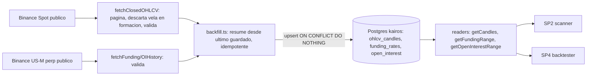

# Kairos — Fase 1 / SP1: Market-data & almacenamiento — Diseño

> Spec de diseño. Fecha: 2026-06-25.
> Fuente de verdad del diseño global: `ARCHITECTURE.md` (§15 datos de mercado, §8 estado, §20 backtesting).
> Este documento acota **un** sub-proyecto de la Fase 1; no rediseña nada de `ARCHITECTURE.md`.

---

## 0. Contexto: descomposición de la Fase 1

La Fase 1 (§13) — "loop determinista en sim, sin LLM" — abarca varios subsistemas independientes,
así que se descompone en 5 sub-proyectos, cada uno con su propio ciclo spec → plan → implementación.
El backtester y el loop en vivo **comparten el mismo núcleo** (scanner → `check_risk` → paper-sim),
porque el backtester es "sim sobre histórico" (§20.1). Por eso se construye el núcleo una vez y se
envuelve dos veces: primero con un driver de replay (offline, valida *edge*), después con el
scheduler BullMQ (always-on, valida *plumbing*).

| # | Sub-proyecto | Entrega | §ARCH |
|---|---|---|---|
| **SP1** | **Market-data & almacenamiento** | Ingesta REST de OHLCV (+ funding/OI read-only), repos, backfill, integridad (solo velas cerradas). **Este spec.** | §15 |
| SP2 | Scanner (indicadores → features → motor de reglas → signals) | Wrappers de indicadores, features, predicados, árbol `trigger_config`, gate MTF, escribe `signals`. | §16 |
| SP3 | Riesgo + ejecución sim | `check_risk`, sizing fijo-fraccional + stop ATR, escalera de drawdown, `paper-sim`, `execute_order` sim, OCO simulado. | §18, §19 |
| SP4 | Backtester | Driver de replay barra-a-barra sobre SP1 a través de SP2+SP3, anti-look-ahead, métricas, `backtest_runs`. **Primer hito end-to-end.** | §20 |
| SP5 | Loop en vivo (sim) | Scheduler BullMQ, monitor de posiciones, reconciler, `account_snapshots`, caché Redis caliente. | §5-B, §15 |

Orden de construcción: **SP1 → SP2 → SP3 → SP4 → SP5** (backtester antes del loop vivo). Con SP1–SP4
ya se puede validar el *edge mecánico* de una estrategia sin construir scheduler ni WS.

---

## 1. Objetivo de SP1

Poblar el **histórico reproducible** en Postgres (esquema `kairos`) que SP2 (scanner) y SP4
(backtester) leen, mediante **ingesta REST idempotente** vía ccxt. SP1 es la capa de datos: no
decide, no razona, no mueve dinero.

**No incluye** (fronteras de alcance acordadas):
- **Scheduler / cron BullMQ** → SP5. SP1 entrega backfill + funciones "fetch-forward" idempotentes.
- **WebSocket** (precio en vivo, stream de liquidaciones) → diferido (§15.1: WS es enriquecimiento
  best-effort; el loop determinista decide sobre REST). `liquidations` no se ingesta en SP1.
- **Caché caliente Redis** (TTL ≈ 1 vela) → SP5, donde el loop vivo la consume cada tick. El camino
  offline (SP2→SP4) lee de Postgres.
- **Read tools `defineTool`** (`fetch_ohlcv`, `fetch_ticker`… de §7) → Fase 2. El scanner de SP2 es
  código determinista y consume los **readers de repo directamente**; los wrappers model-callable
  llegan cuando el LLM los necesita.
- **Cómputo de features** (`funding_z`, `oi_change_pct`… §15.4) → SP2. SP1 almacena datos **crudos**.
- **DDL**: las tablas ya existen (Fase 0, `src/db/schema.sql`). SP1 no crea ni altera tablas.

---

## 2. Decisiones de alcance fijadas

| Perilla | Decisión |
|---|---|
| Universo de símbolos | `BTC/USDT`, `ETH/USDT` (major caps, on-chain fiable §17.2, máxima liquidez) |
| Timeframes | `15m` (gatillo), `1h` (contexto), `4h` (sesgo) — los de la estrategia semilla §16.3 |
| Profundidad de historia | ~2 años (`BACKFILL_DAYS = 730`) para OHLCV y funding |
| Datos del perp | funding + open interest (REST). Liquidaciones **no** (son WS, diferidas) |
| Retención de OI | Ver §6: Binance retiene poco OI histórico; se backfillea lo disponible + recolecta hacia adelante |
| Cliente ccxt | **Público** (sin API key). OHLCV desde Spot; funding/OI desde el mercado **US-M perp** |

---

## 3. Modelo de datos (tablas existentes, sin DDL)

De `src/db/schema.sql` (Fase 0). SP1 escribe en estas tres y lee de ellas:

```sql
kairos.ohlcv_candles (symbol, timeframe, open_time, o, h, l, c, v, PRIMARY KEY (symbol, timeframe, open_time))
kairos.funding_rates (symbol, ts, rate, PRIMARY KEY (symbol, ts))
kairos.open_interest (symbol, ts, oi, oi_value, PRIMARY KEY (symbol, ts))
```

La **idempotencia es por PK**: el upsert usa `ON CONFLICT (...) DO NOTHING`. Re-ingestar la misma
vela/ts nunca duplica. Regla de integridad (§15.3): `ohlcv_candles` solo recibe **velas cerradas**.

---

## 4. Componentes y archivos

Núcleo determinista en `src/lib/` (NO model-callable, §12); repos en `src/db/repositories/`.

| Archivo | Responsabilidad |
|---|---|
| `src/lib/market-data/config.ts` | Constantes: `SYMBOLS`, `TIMEFRAMES`, `BACKFILL_DAYS`, retención de OI, helper `timeframeToMs`. Sin números mágicos dispersos. |
| `src/lib/market-data/ohlcv.ts` | `fetchClosedOHLCV(...)`: pagina ccxt, **descarta la vela en formación**, valida con Valibot la respuesta cruda. |
| `src/lib/market-data/derivatives.ts` | `fetchFundingHistory(...)` / `fetchOpenInterestHistory(...)` desde el perp; valida con Valibot. |
| `src/lib/market-data/backfill.ts` | Comando CLI (patrón `src/db/migrate.ts`): orquesta backfill resumible e idempotente; reporta y sale ≠0 ante fallo persistente. |
| `src/db/repositories/ohlcv-candles.ts` | `upsertCandles`, `getLatestOpenTime`, `getCandles`. |
| `src/db/repositories/funding-rates.ts` | `upsertFundingRates`, `getLatestFundingTs`, `getFundingRange`. |
| `src/db/repositories/open-interest.ts` | `upsertOpenInterest`, `getLatestOiTs`, `getOpenInterestRange`. |

Posible adición pequeña a `src/lib/ccxt-client.ts`: `createPerpPublicClient()` (público, mercado
US-M perp) para funding/OI, dejando `createPublicClient()` para Spot. A confirmar contra ccxt si
basta `options.defaultType` o conviene una instancia separada (`binanceusdm`).

### 4.1 Interfaces (lo que SP2 y SP4 consumirán)

```ts
// Tipos de fila (camelCase en TS; columnas snake_case en SQL)
interface OhlcvRow {
  symbol: string; timeframe: string; openTime: Date;
  o: number; h: number; l: number; c: number; v: number;
}
interface FundingRow { symbol: string; ts: Date; rate: number; }
interface OpenInterestRow { symbol: string; ts: Date; oi: number; oiValue: number | null; }

// ohlcv-candles.ts
function upsertCandles(rows: OhlcvRow[]): Promise<number>;                 // nº filas insertadas
function getLatestOpenTime(symbol: string, timeframe: string): Promise<Date | null>;
function getCandles(symbol: string, timeframe: string, from: Date, to: Date): Promise<OhlcvRow[]>; // asc

// funding-rates.ts
function upsertFundingRates(rows: FundingRow[]): Promise<number>;
function getLatestFundingTs(symbol: string): Promise<Date | null>;
function getFundingRange(symbol: string, from: Date, to: Date): Promise<FundingRow[]>; // asc

// open-interest.ts
function upsertOpenInterest(rows: OpenInterestRow[]): Promise<number>;
function getLatestOiTs(symbol: string): Promise<Date | null>;
function getOpenInterestRange(symbol: string, from: Date, to: Date): Promise<OpenInterestRow[]>; // asc

// ohlcv.ts
function fetchClosedOHLCV(
  client: Exchange, symbol: string, timeframe: string, since: number, limit?: number,
): Promise<OhlcvRow[]>; // solo velas cerradas, asc por openTime

// derivatives.ts
function fetchFundingHistory(
  client: Exchange, symbol: string, since: number, limit?: number,
): Promise<FundingRow[]>;
function fetchOpenInterestHistory(
  client: Exchange, symbol: string, timeframe: string, since: number, limit?: number,
): Promise<OpenInterestRow[]>;
```

El upsert por lote construye un `INSERT ... VALUES (...),(...) ON CONFLICT DO NOTHING`
parametrizado (chunked para no exceder el límite de parámetros de pg). Reutiliza `query` de
`src/db/pool.ts`.

---

## 5. Flujo de datos



**Backfill (resumible, idempotente):** por cada `(symbol, tf)`, `since = getLatestOpenTime ?? (now −
BACKFILL_DAYS)`; bucle `fetchClosedOHLCV(since)` → `upsertCandles` → avanza `since` al último
`openTime + tfMs`; hasta alcanzar `now` o respuesta vacía. Funding/OI análogo por `ts`. Re-correr
reanuda desde lo ya guardado (no re-descarga todo).

---

## 6. Restricción conocida: retención de OI

El histórico de OHLCV (klines) y de funding rate en Binance llega años atrás; el endpoint de
**open interest histórico retiene poco** (≈30 días, **a verificar** contra la doc real de ccxt /
Binance al implementar). Implicación honesta:

- OHLCV y funding → backfill ~2 años limpio.
- OI → se backfillea **hasta donde el exchange exponga** (probablemente ≈30 días) y luego se
  **recolecta hacia adelante** (forward-fill, vía el cron de SP5).
- SP4 (backtester) tratará OI como **feature opcional/dispersa**: su ausencia en tramos antiguos del
  backtest no rompe el cómputo; las features que dependen de OI (§15.4) se marcan `null` cuando falta.

Esto no bloquea SP1: solo acota qué tan atrás llega OI. Se documenta para que SP2/SP4 no asuman OI
denso a 2 años.

---

## 7. Verificación contra docs reales (regla del proyecto)

Verificar **al implementar**, nunca de memoria (CLAUDE.md + skill `ccxt-typescript`):

- Firmas y nombres ccxt: `fetchOHLCV(symbol, timeframe, since, limit)`,
  `fetchFundingRateHistory`, `fetchOpenInterestHistory` — nombres exactos, params y forma del
  retorno (timestamps ms, orden, campos).
- Cómo seleccionar el mercado **US-M perp** en ccxt para funding/OI (`options.defaultType: 'future'`
  vs instancia `binanceusdm`), y qué símbolo usa el perp (`BTC/USDT:USDT` vs `BTC/USDT`).
- Límite real de velas por request y paginación por `since`.
- Retención efectiva del OI histórico (§6).

---

## 8. Manejo de errores

- Error de red / rate-limit de ccxt → **reintento acotado con backoff** (además de
  `enableRateLimit` del cliente). Sin bucle infinito.
- Fallo persistente de un `(symbol, tf, ventana)` → el backfill lo **reporta** (qué falló y dónde) y
  **sale con código ≠ 0**. No traga errores ni los oculta (coding-style).
- Idempotencia → re-ejecutar tras un fallo **reanuda** desde lo ya guardado sin duplicar.
- Validación en el límite: la respuesta cruda de ccxt (dato externo no confiable) se valida con
  **Valibot** antes de insertar. Una fila malformada se trata como **contrato ccxt roto** (nuestro
  parser quedó desalineado, no un dato aislado) → **lanza** y aborta el lote; el backfill reporta y
  sale ≠0. No se descartan filas en silencio (evita enmascarar un cambio de forma de ccxt).

---

## 9. Estrategia de pruebas (TDD, ≥80%)

- **Unit (ccxt mockeado):**
  - `fetchClosedOHLCV` descarta la vela en formación (la última con `openTime + tfMs > now`).
  - Paginación: encadena requests avanzando `since` hasta cubrir la ventana.
  - Validación Valibot: respuesta malformada → **lanza** (contrato ccxt roto), no inserta basura.
  - `timeframeToMs` mapea `15m/1h/4h` correctamente.
- **Integración (Postgres de docker):**
  - `upsertCandles` idempotente: insertar el mismo lote dos veces → 0 duplicados (PK), conteo correcto.
  - `getCandles` / `get*Range` devuelven el rango ascendente correcto y excluyen fuera de `[from,to]`.
  - `getLatestOpenTime` / `getLatest*Ts` devuelven el máximo o `null`.

No se testea contra la API real de Binance en CI (flaky, lento); el contrato ccxt se cubre con mocks
y se valida manualmente al correr el backfill una vez.

---

## 10. Líneas rojas aplicables (no violar)

- **Solo cliente público** en SP1 (sin API key): toda la ingesta es de datos públicos (§7). Ninguna
  credencial de exchange entra en este sub-proyecto.
- **Ninguna tool de mutación** se toca ni se importa. SP1 no ejecuta órdenes.
- **Sin secretos hardcodeados**; `DATABASE_URL` desde entorno (ya validado en `pool.ts`).
- **Sin `console.log` de debug**; el reporte del CLI usa salida intencional (patrón `migrate.ts`).
- Estilo: funciones <50 líneas, archivos <800, anidamiento ≤4, inmutabilidad, validación en límites.
- Comentarios/commits en español; identificadores en inglés.

---

## 11. Criterios de éxito (verificables)

1. `npm run backfill` (o `node --experimental-strip-types src/lib/market-data/backfill.ts`) puebla
   `ohlcv_candles` con ~2 años de velas cerradas para 2 símbolos × 3 TFs, y `funding_rates` /
   `open_interest` con la historia disponible.
2. Re-correr el backfill inserta **0 duplicados** (idempotente) y reanuda desde lo guardado.
3. Solo hay velas **cerradas** en `ohlcv_candles` (ninguna en formación).
4. Los readers devuelven rangos ascendentes correctos (verificado por tests de integración).
5. `npm run typecheck` limpio; suite verde; cobertura ≥80%.
6. Cero violaciones de líneas rojas (§10): solo cliente público, sin secretos, sin tools de mutación.
