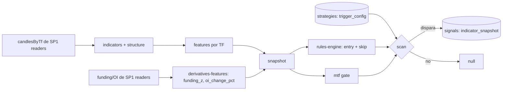

# Kairos — Fase 1 / SP2: Scanner (indicadores → features → motor de reglas → signals) — Diseño

> Spec de diseño. Fecha: 2026-06-25.
> Fuente de verdad del diseño global: `ARCHITECTURE.md` (§16 análisis técnico, §15.4 features de derivados, §8 estado).
> Este documento acota **un** sub-proyecto de la Fase 1; no rediseña nada de `ARCHITECTURE.md`.

---

## 0. Contexto: descomposición de la Fase 1

La Fase 1 ("loop determinista en sim, sin LLM") se descompuso en 5 sub-proyectos. Este es **SP2**.

| # | Sub-proyecto | Estado |
|---|---|---|
| SP1 | Market-data & almacenamiento (§15) | **Mergeado** (readers `getCandles`/`getFundingRange`/`getOpenInterestRange` disponibles) |
| **SP2** | **Scanner: indicadores → features → motor de reglas → signals (§16)** | **Este spec** |
| SP3 | Riesgo + ejecución sim (§18/§19) | Pendiente |
| SP4 | Backtester (§20) | Pendiente |
| SP5 | Loop en vivo (§5-B, §15) | Pendiente |

El núcleo del scanner debe ser **reusable por SP4 (backtester) y SP5 (loop vivo)**: el backtester es "sim sobre histórico" y reutiliza el mismo code path (§20.1). Por eso el corazón es una función pura sobre velas inyectadas.

---

## 1. Objetivo de SP2

Dado un strategy config + un símbolo + velas por timeframe, **producir determinísticamente un `signal` o nada**: computar indicadores → features normalizados → evaluar el árbol de reglas declarativo → aplicar el gate MTF top-down → persistir el `signal` con su `indicator_snapshot`. *Mira los números, no juzga* (§16.1): SP2 no razona, no llama LLM, no toca dinero.

**No incluye** (fronteras de alcance acordadas):
- **Scheduler/cron BullMQ y lock Redis** → SP5. SP2 entrega `scan` (puro) + `scanSymbol` (lee SP1, persiste); SP5 los invoca en cadencia.
- **Encolar `evaluate-candidate` y el `technical-read` del LLM** → Fase 2. SP2 escribe `signals`; no dispara razonamiento.
- **`check_risk` / sizing / ejecución** → SP3.
- **Read tools `defineTool`** (`get_technical_snapshot`, …) → Fase 2; el scanner es código determinista que lee los readers de SP1 directamente.
- **DDL**: `strategies` y `signals` ya existen (Fase 0, `src/db/schema.sql`). SP2 no crea ni altera tablas.

---

## 2. Decisiones de alcance fijadas

| Perilla | Decisión |
|---|---|
| Amplitud | **Completa (§16.3)**: las 5 familias de indicadores, incl. estructura propia, y la estrategia semilla canónica de §16.3. |
| Estrategia semilla | Pullback alcista con confirmación (§16.3): ver §4.4. |
| Features de derivados | `funding_z` (z-score sobre `funding_rates` de SP1) — lo usa el skip. `oi_change_pct` incluido (OI puede ser disperso, §SP1; feature opcional). |
| Política de datos insuficientes | Si una TF de la estrategia no alcanza el **warmup** de sus indicadores (la lookback más larga, p.ej. 200 para EMA200) → `scan` devuelve **null** (no dispara con datos incompletos). Regla determinista por-TF, no por-hoja. |
| `mtf_alignment` | Direccional vía `ema_stack` a través de bias/context/trigger; `counter` filtrado por código salvo `allow_counter` en config. |
| Dependencia | `technicalindicators` (npm) — su API se verifica contra su doc real al implementar. |

---

## 3. Modelo de datos (tablas existentes, sin DDL)

De `src/db/schema.sql` (Fase 0). SP2 lee `strategies`, escribe `signals`:

```sql
kairos.strategies (id, enabled, timeframe, symbols[], trigger_config jsonb, risk_params jsonb, skill_name?, version, created_at)
kairos.signals    (id text PK, strategy_id FK, symbol, fired_at, indicator_snapshot jsonb, status DEFAULT 'fired')
```

`risk_params` lo consume SP3; SP2 solo necesita que la fila semilla lleve un jsonb válido no-nulo (SP3 define su esquema). `signals.id` es ULID (como `audit_log`). `indicator_snapshot` guarda el snapshot completo (§4.5).

---

## 4. Componentes e interfaces

Núcleo determinista en `src/lib/scanner/`; repos en `src/db/repositories/`. Cada archivo, una responsabilidad.

| Archivo | Responsabilidad |
|---|---|
| `scanner/indicators.ts` | Envuelve `technicalindicators`: EMA 20/50/200, MACD, ADX, RSI, StochRSI, ATR, Bollinger, VWAP, OBV, MFI — por TF, sobre velas **cerradas**. Devuelve series/últimos valores crudos. |
| `scanner/structure.ts` | **Propio**: swing highs/lows por pivotes (ventana de lookback) → niveles de soporte/resistencia. |
| `scanner/features.ts` | Normaliza salidas crudas → `Features` por TF (incl. valores previos para predicados de cruce). |
| `scanner/derivatives-features.ts` | `funding_z` (z-score), `oi_change_pct` desde `funding_rates`/`open_interest` (SP1). |
| `scanner/predicates.ts` | Librería de predicados puros `(features, args, ctx) → boolean`. |
| `scanner/rules-engine.ts` | Evalúa el árbol `trigger_config` validado (nodos `all`/`any`/predicado con `tf`); entry + skip. |
| `scanner/mtf.ts` | Computa `mtf_alignment` y aplica el gate top-down (§16.4). |
| `scanner/snapshot.ts` | Arma `IndicatorSnapshot`. |
| `scanner/scan.ts` | `scan(...)` puro + `scanSymbol(...)` (lee SP1, persiste). |
| `scanner/config-schema.ts` | Schema Valibot de `trigger_config` (árbol recursivo); valida al cargar la estrategia. |
| `db/repositories/strategies.ts` | `getEnabledStrategies()`, `getStrategy(id)` — parsea+valida `trigger_config`. |
| `db/repositories/signals.ts` | `insertSignal(signal) → id`, append-first. |
| `db/seed-strategies.ts` | Inserta la estrategia semilla §16.3 (idempotente). |

### 4.1 Tipos núcleo (nivel firma; el código exacto va en el plan)

```ts
import type { OhlcvRow } from '../market-data/types.ts';      // vela = OhlcvRow de SP1
type CandlesByTimeframe = Record<string, OhlcvRow[]>;          // { '4h': [...], '1h': [...], '15m': [...] } ascendente

interface Features {                                            // por TF; null cuando faltan datos
  close: number;
  emaStack: 'bullish' | 'bearish' | 'mixed' | null;            // 20>50>200 → bullish
  macdCross: 'up' | 'down' | 'none' | null;
  adx: number | null;
  rsi: number | null; rsiPrev: number | null; rsiState: 'oversold' | 'neutral' | 'overbought' | null;
  stochRsi: number | null;
  atrPct: number | null; bbPosition: number | null;
  aboveVwap: boolean | null; obv: number | null; mfi: number | null;
  nearestSupport: number | null; distToSupportPct: number | null; nearestResistance: number | null;
}

interface DerivativesContext { fundingZ: number | null; oiChangePct: number | null; }

interface IndicatorSnapshot {
  byTimeframe: Record<string, Features>;
  mtfAlignment: 'aligned' | 'mixed' | 'counter';
  levels: { support: number | null; resistance: number | null };
  derivatives: DerivativesContext;
}

interface Signal { strategyId: string; symbol: string; firedAt: Date; snapshot: IndicatorSnapshot; }

// Núcleo PURO (reusable por SP4/SP5): velas inyectadas, no lee DB.
function scan(
  strategy: Strategy, symbol: string,
  candlesByTf: CandlesByTimeframe, deriv: DerivativesContext, now: Date,
): Signal | null;

// Conveniencia: lee velas+derivados de SP1, llama scan, persiste si dispara. Devuelve el id o null.
function scanSymbol(strategy: Strategy, symbol: string, asOf: Date): Promise<string | null>;
```

### 4.2 Predicados (primer corte)

Puros, componibles, `(features, args, ctx) → boolean`. Los del árbol semilla + un set base:
`ema_stack_bullish`, `ema_stack_bearish`, `above_vwap`, `below_vwap`, `rsi_cross_up {level}`,
`rsi_oversold`, `rsi_overbought`, `macd_cross_up`, `macd_cross_down`, `near_support {max_dist_pct}`,
`atr_pct_above {max}`, `adx_above {min}`, `funding_z_extreme {max_abs}`.

Los predicados de **cruce** (`rsi_cross_up`, `macd_cross_*`) requieren el valor actual y el previo: por eso `Features` carga `rsiPrev` y `macdCross` ya resuelto. `funding_z_extreme` lee `ctx.deriv.fundingZ`.

### 4.3 Motor de reglas (§16.3)

`trigger_config` es un árbol de nodos validado con Valibot (`config-schema.ts`):
- nodo `{ all: Node[] }` → AND; `{ any: Node[] }` → OR; `{ tf?, predicate, args? }` → hoja.
- `entry` define el setup; `skip` son vetos duros (si CUALQUIER skip es true → no dispara).
- Cada hoja resuelve `features[tf]` (TF explícito) y aplica el predicado. Sin `tf` → usa el TF gatillo.
- **Datos insuficientes (warmup)**: antes de evaluar, si alguna TF de la estrategia no alcanza el warmup mínimo (la lookback más larga entre sus indicadores, p.ej. 200 velas para EMA200) → `scan` devuelve **null** sin evaluar. Regla determinista por-TF, independiente del corto-circuito del árbol.
- **Feature puntual null con datos suficientes** (p.ej. sin soporte cercano → `nearestSupport` null): la hoja que lo lee devuelve `false` (predicado no satisfecho), no provoca que el `scan` retorne null. Distinto de "datos insuficientes".

### 4.4 Estrategia semilla (§16.3) — fila exacta

`trigger_config`:
```jsonc
{
  "timeframes": { "bias": "4h", "context": "1h", "trigger": "15m" },
  "entry": { "all": [
    { "tf": "4h",  "predicate": "ema_stack_bullish" },
    { "tf": "1h",  "predicate": "above_vwap" },
    { "tf": "15m", "predicate": "rsi_cross_up", "args": { "level": 40 } },
    { "tf": "15m", "predicate": "near_support", "args": { "max_dist_pct": 0.5 } }
  ] },
  "skip": { "any": [
    { "tf": "15m", "predicate": "atr_pct_above", "args": { "max": 4 } },
    { "predicate": "funding_z_extreme", "args": { "max_abs": 2.5 } }
  ] }
}
```
Fila: `id='pullback-alcista'`, `enabled=true`, `timeframe='15m'`, `symbols={BTC/USDT,ETH/USDT}`,
`risk_params` = jsonb starter (p.ej. `{"risk_per_trade_pct":0.5,"atr_stop_mult":1.5,"max_notional_pct":10}`; **SP3 define el esquema real**), `version=1`.

### 4.5 Gate MTF (§16.4)

`mtf_alignment` se computa por dirección desde `emaStack` de cada TF (spot = setups long):
- `counter` si el TF **bias** es `bearish` (gatillo long opuesto al sesgo mayor);
- `aligned` si bias `bullish` y context no `bearish`;
- `mixed` en cualquier otro caso.

Gate determinista: `counter` → `scan` devuelve null (no dispara) salvo `trigger_config.allow_counter === true`. `mtf_alignment` viaja en el snapshot para que el LLM (Fase 2) module confianza ante `mixed`.

---

## 5. Flujo de datos



`scanSymbol` lee las últimas N velas por TF (constante `LOOKBACK`, suficiente para EMA200, p.ej. 300) hasta `asOf` vía `getCandles`, y funding/OI vía `getFundingRange`/`getOpenInterestRange`; arma el contexto, llama `scan`, y si hay signal lo persiste con `insertSignal`. El backtester (SP4) llamará `scan` directamente con barras de replay.

---

## 6. Verificación contra docs reales (regla del proyecto)

Verificar **al implementar**, nunca de memoria (CLAUDE.md):
- API de `technicalindicators`: nombres y forma de entrada/salida de `EMA`, `MACD`, `ADX`, `RSI`, `StochasticRSI`, `ATR`, `BollingerBands`, `VWAP`, `OBV`, `MFI` (qué arrays de entrada espera cada uno, cómo devuelve la serie). Confirmar contra su `README`/tipos en `node_modules/technicalindicators`.
- Valibot recursivo: el schema del árbol usa `v.lazy` para nodos `all`/`any` anidados.

---

## 7. Manejo de errores

- **`trigger_config` malformado** → Valibot lanza al cargar la estrategia (`config-schema.ts`). No se evalúa config inválido.
- **Datos insuficientes** (TF sin warmup mínimo) → `scan` devuelve null antes de evaluar (§4.3). No lanza; no dispara.
- **Símbolo sin velas** → `scanSymbol` no encuentra datos → null (nada que escanear), registrado sin error.
- Sin descarte silencioso de errores reales: un fallo de lectura de SP1 (DB) se propaga.

---

## 8. Estrategia de pruebas (TDD, ≥80%)

- **Unit (sin DB):**
  - `indicators.ts`: cada indicador vs fixtures conocidos / salida de `technicalindicators`.
  - `structure.ts`: swings/S-R sobre una serie sintética con pivotes conocidos.
  - `features.ts`: normalización (emaStack, rsiState, atrPct, bbPosition, aboveVwap, distToSupportPct) + valores previos para cruces.
  - `derivatives-features.ts`: `funding_z` z-score sobre serie conocida; `oi_change_pct`.
  - `predicates.ts`: table-driven por predicado (true/false en bordes; args).
  - `rules-engine.ts`: árbol `all`/`any`/anidado; entry + skip; datos incompletos → no dispara.
  - `mtf.ts`: aligned/mixed/counter y el gate (counter filtrado salvo `allow_counter`).
  - `scan.ts`: end-to-end puro con velas sintéticas → dispara / no dispara / skip / counter.
- **Integración (Postgres de docker):** `strategies` repo (carga+valida la semilla), `signals` repo (insert), y un caso end-to-end: seed strategy + velas de SP1 (`upsertCandles`) → `scanSymbol` → `signal` persistida con snapshot correcto.

---

## 9. Líneas rojas aplicables

- **Sin LLM, sin tools de mutación, sin credenciales**: SP2 es determinista y de solo lectura sobre datos; no importa clientes autenticados ni tools de ejecución.
- **Validación Valibot** (no zod) del `trigger_config` en el límite.
- **Solo velas cerradas** (heredado: las velas vienen de `ohlcv_candles`, que SP1 garantiza cerradas).
- `signals` es **append-first** (insert, nunca update en SP2).
- Estilo: funciones <50 líneas, archivos <800, anidamiento ≤4, inmutabilidad, sin secretos, sin `console.log`. Comentarios/commits en español; identificadores en inglés.

---

## 10. Criterios de éxito (verificables)

1. Con la estrategia semilla sembrada y velas sintéticas que cumplen el setup, `scan` produce un `signal` con `indicator_snapshot` completo (`byTimeframe`, `mtfAlignment`, `levels`, `derivatives`).
2. Cuando un skip veto aplica (p.ej. `atr_pct_above` o `funding_z_extreme`), `scan` devuelve null aunque el entry se cumpla.
3. Cuando el sesgo HTF contradice el setup (`mtf_alignment === 'counter'`), `scan` devuelve null (salvo `allow_counter`).
4. Datos insuficientes (warmup) → `scan` devuelve null, no lanza.
5. `scanSymbol` end-to-end: seed strategy + velas en Postgres → `signal` persistida (verificado por test de integración).
6. `npm run typecheck` limpio; suite verde; cobertura ≥80% en las 4 métricas.
7. Cero violaciones de líneas rojas (§9) y cero fuga de alcance (sin scheduler, sin Redis, sin LLM, sin `check_risk`).
